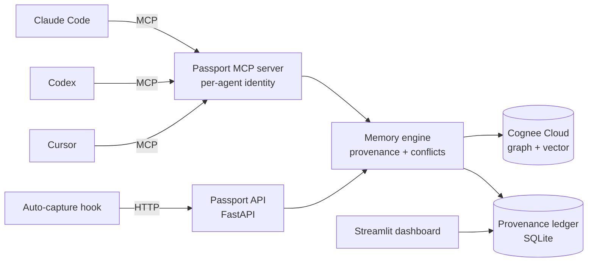

# 🧳 Passport — a shared memory layer for your AI coding agents

> Teach **Claude Code** something once, and **Cursor** and **Codex** know it too — forever.
> Passport gives your whole fleet of AI agents **one shared brain**, and it remembers
> **which agent taught it what**, flags when two agents **disagree**, and lets you
> **forget** on command. Powered by [Cognee](https://github.com/topoteretes/cognee).

Built for **The Hangover Part AI** hackathon (WeMakeDevs × Cognee).

---

## The problem

Every LLM call is stateless, and today's memory layers are **siloed per app**. You run a
*fleet* of AI coding agents — Claude Code, Cursor, Codex — but each is an amnesiac island.
What you teach one, the others never learn. You re-explain your stack, conventions, and
decisions over and over, and agents repeat mistakes another agent already fixed.

## What Passport does (the 90-second demo)

1. In **Claude Code**: *"Remember we use pytest, never unittest, and our DB is Postgres."*
2. In **Codex** (a different vendor's agent, fresh session): *"What testing framework and DB do we use?"* → it answers **pytest + Postgres** — facts it never saw. ✅ *(verified live)*
3. The **dashboard** shows a provenance graph: every memory colored by the agent that taught it.
4. Tell one agent the DB is now **MySQL** → Passport's conflict detector (Cognee's own LLM)
   flags the contradiction with Postgres, and `reconcile()` resolves it — recall now returns MySQL.
5. `forget()` wipes a project. Your memory, yours.

## Why this is different (not just another memory library)

Every published agent-memory system is **single-agent**. Passport is a **shared memory
substrate for a heterogeneous fleet**, adding what none of them combine: per-agent
**provenance**, cross-agent **conflict reconciliation**, and a live provenance graph.

| System | What it does | What it does *not* do |
|---|---|---|
| MemGPT ([2310.08560](https://arxiv.org/abs/2310.08560)) | Hierarchical single-agent memory | No shared multi-agent graph |
| Mem0 ([2504.19413](https://arxiv.org/abs/2504.19413)) | Production single-app memory | No cross-tool identity/provenance |
| Zep/Graphiti ([2501.13956](https://arxiv.org/abs/2501.13956)) | Temporal KG for one agent | Single-agent scope |
| A-MEM ([2502.12110](https://arxiv.org/abs/2502.12110)) | Memory evolution, single agent | No multi-source provenance |
| **Passport** | **Shared brain across agents** | — |

## Architecture



- **MCP server** (`passport/mcp_server.py`) — every agent connects with its own `--agent`
  identity, so writes are tagged with provenance. All agents share one Cognee tenant + project.
- **API server** (`passport/server.py`) — `remember / recall / improve / forget / conflicts /
  reconcile / ledger`, with API-key auth. Also the hub for the auto-capture hook.
- **Memory engine** (`passport/memory.py`) — thin, provenance-aware wrapper over Cognee.
- **Provenance ledger** (`passport/ledger.py`) — local SQLite of who-taught-what; source for
  the dashboard and conflict log.
- **Dashboard** (`dashboard/app.py`) — live provenance graph colored by agent, timeline, conflicts.
- **Auto-capture** (`hooks/capture_hook.py`) — a Claude Code hook that captures durable facts
  automatically (with an importance filter), so you don't have to call a tool.

## How deeply it uses Cognee (the memory lifecycle)

| Cognee API | Passport usage |
|---|---|
| `remember(node_set=…)` | Every write tagged with agent/session/project provenance |
| `recall(node_name=…, auto_route=True)` | Hybrid vector+graph recall, scoped or global |
| `recall(system_prompt=…)` | **Conflict detection** — Cognee's LLM finds contradictions |
| `improve()` / memify | Reconciliation enrichment (self-hosted/OSS; 404 on Cloud) |
| `forget()` | Surgical, provenance-aware deletion |

## Evaluation (measured, not claimed)

Run live against Cognee Cloud via `scripts/eval_harness.py` — reproducible:

| Metric | Result |
|---|---|
| Cross-agent recall@1 (facts taught by one agent, retrieved by a paraphrased query) | **4/4 (100%)** |
| Tenant isolation (two tenants, contradictory facts, measured leakage) | **2/2 (100% non-leak)** |
| Ranking correctness (authoritative recent decision outranks stale note) | **PASS** |

Focused harness (not a full benchmark), but every number is produced by a real run —
semantic recall, hard tenant isolation, and LLM-scored ranking all verified end-to-end.

## Quick start

```bash
pip install -r requirements.txt
cp .env.template .env      # add your Cognee Cloud key + tenant URL (code COGNEE-35 = free)

# API server (also the auto-capture hub)
python -m uvicorn passport.server:app --port 8000

# dashboard
python -m streamlit run dashboard/app.py
```

Register the MCP server in each agent (own identity per agent):

```bash
claude mcp add passport -- <venv-python> <path>/run_mcp.py --agent claude-code
# Cursor: ~/.cursor/mcp.json   |   Codex: ~/.codex/config.toml   (see docs)
```

## Research grounding

Passport's design borrows from the agent-memory literature: retrieval by
recency/relevance/importance (**Generative Agents**, [2304.03442](https://arxiv.org/abs/2304.03442)),
hierarchical memory (**MemGPT**, [2310.08560](https://arxiv.org/abs/2310.08560)),
temporal knowledge graphs (**Zep/Graphiti**, [2501.13956](https://arxiv.org/abs/2501.13956)),
memory evolution (**A-MEM**, [2502.12110](https://arxiv.org/abs/2502.12110)),
graph multi-hop retrieval (**HippoRAG**, [2405.14831](https://arxiv.org/abs/2405.14831)),
and learn-from-feedback loops (**Reflexion**, [2303.11366](https://arxiv.org/abs/2303.11366)).

## Tech stack

Python · FastAPI · [Cognee](https://github.com/topoteretes/cognee) (Cloud) · MCP · Streamlit · SQLite

## AI assistance disclosure

Per hackathon rules: this project was built with the help of **Claude Code** (Anthropic) as a
pair-programming assistant. All architecture decisions, integration, and testing were
directed by the team.

## License

MIT.
